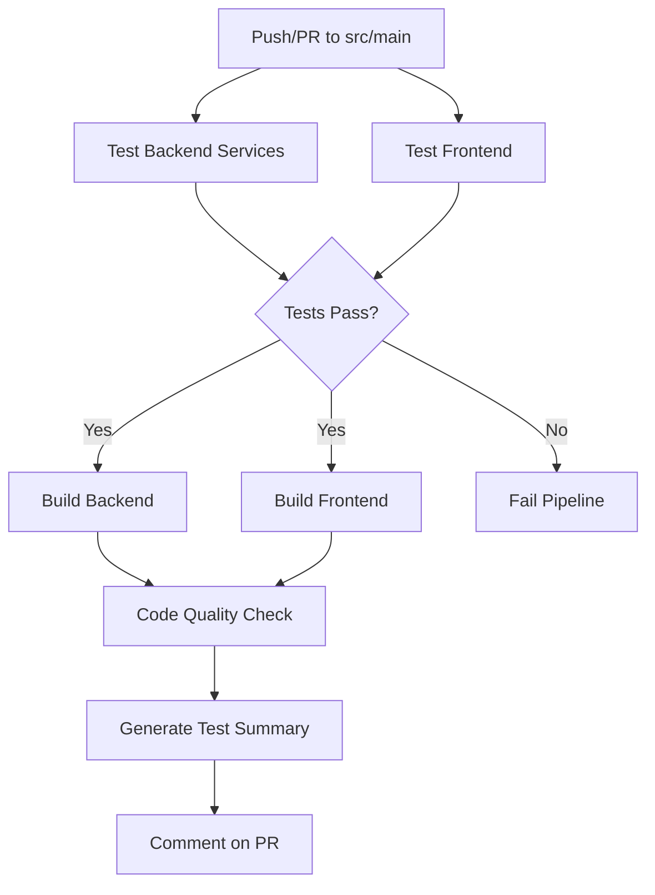
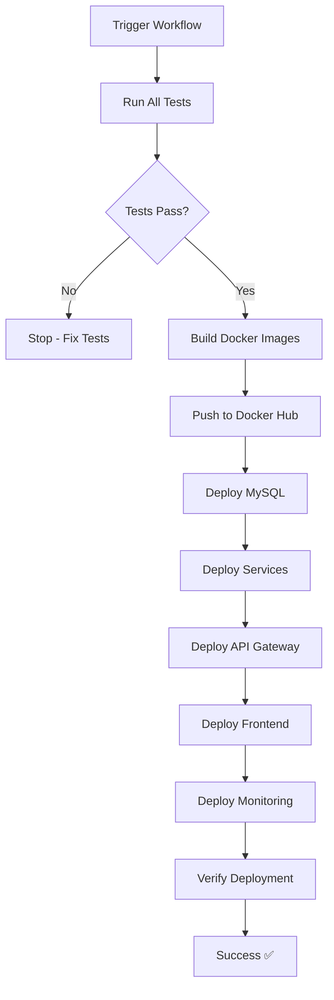

# 🚀 CI/CD Workflows Documentation

## 📋 Available Workflows

### 1. **ci.yml** - Continuous Integration (Full Testing)
**Trigger**: Push/PR to `src` or `main` branch  
**Purpose**: Run comprehensive tests and builds for all services

#### Workflow Steps:
1. ✅ **Test Backend Services** (Parallel)
   - user-service tests
   - order-service tests
   - restaurant-service tests
   - payment-service tests
   - api-gateway tests

2. ✅ **Test Frontend**
   - Linting
   - Unit tests
   - Code coverage

3. ✅ **Build Backend Services** (After tests pass)
   - Compile and package JARs
   - Upload artifacts

4. ✅ **Build Frontend** (After tests pass)
   - Production build
   - Upload dist artifacts

5. ✅ **Code Quality Checks**
   - Security vulnerability scanning
   - Dependency check

6. ✅ **Test Summary Report**
   - Generate GitHub summary
   - Comment on PR

---

### 2. **deploy-k8s.yml** - Full CI/CD Deployment
**Trigger**: Push to `main`/`src` or manual trigger  
**Purpose**: Test, build, and deploy to Kubernetes

#### Workflow Steps:
1. 🧪 **Run All Tests** (Job 1)
   - User Service tests
   - Order Service tests
   - Restaurant Service tests
   - Payment Service tests
   - API Gateway tests
   - Frontend tests (optional)

2. 🏗️ **Build & Deploy** (Job 2 - only if tests pass)
   - Build Docker images
   - Push to Docker Hub
   - Deploy to Kubernetes
   - Deploy Monitoring (optional)
   - Verify deployment

---

### 3. **deploy-only.yml** - Deployment Only
**Trigger**: Manual workflow dispatch  
**Purpose**: Quick deployment without building new images

#### Features:
- Skip image build (use existing images)
- Fast deployment (~3-5 minutes)
- Optional monitoring deployment
- Deployment verification

---

### 4. **test-order-service.yml** - Specific Service Testing
**Trigger**: Manual or scheduled  
**Purpose**: Test specific service in isolation

---

## 🎯 When to Use Each Workflow

| Workflow | Use Case | Duration | Trigger |
|----------|----------|----------|---------|
| **ci.yml** | Development - Test before merge | ~10-15 min | Auto (Push/PR) |
| **deploy-k8s.yml** | Production - Full deployment | ~15-20 min | Auto/Manual |
| **deploy-only.yml** | Quick update - Config changes | ~3-5 min | Manual |
| **test-order-service.yml** | Debug specific service | ~5 min | Manual |

---

## 🔧 Workflow Configuration

### **Required Secrets**

Set these in: GitHub → Settings → Secrets and variables → Actions

```
DOCKER_USERNAME=your-dockerhub-username
DOCKER_TOKEN=your-dockerhub-access-token
```

### **Runner Configuration**

#### For Docker Desktop (Local)
```yaml
runs-on: self-hosted
```

Setup guide: [GITHUB_RUNNER_SETUP.md](../../k8s/GITHUB_RUNNER_SETUP.md)

#### For Cloud (GitHub-hosted)
```yaml
runs-on: ubuntu-latest
```

---

## 📊 CI Pipeline Flow (ci.yml)



---

## 🚀 CD Pipeline Flow (deploy-k8s.yml)



---

## 🧪 Test Coverage

### **Backend Tests**
Each backend service runs:
- ✅ Unit tests
- ✅ Integration tests
- ✅ Repository tests
- ✅ Controller tests
- ✅ Service layer tests

### **Frontend Tests**
- ✅ Component tests
- ✅ Service tests
- ✅ Linting (ESLint)
- ✅ Code coverage report

---

## 📦 Artifacts Generated

| Artifact | Description | Retention |
|----------|-------------|-----------|
| `test-results-*` | JUnit test reports | 7 days |
| `*-service-jar` | Compiled JAR files | 7 days |
| `frontend-dist` | Production build | 7 days |
| `frontend-coverage` | Coverage reports | 7 days |

Download artifacts: GitHub Actions → Workflow Run → Artifacts section

---

## 🔍 Debugging Failed Workflows

### **Test Failures**

1. Click on failed job in GitHub Actions
2. Expand failed step
3. Check test output

```bash
# Run tests locally
cd user-service
./mvnw clean test

# Check specific test
./mvnw test -Dtest=UserServiceTest
```

### **Build Failures**

```bash
# Build locally
cd user-service
./mvnw clean package -DskipTests

# Check dependencies
./mvnw dependency:tree
```

### **Deployment Failures**

```bash
# Check pod status
kubectl get pods -n cnpm-food

# Check logs
kubectl logs deployment/user-service -n cnpm-food

# Describe pod
kubectl describe pod <pod-name> -n cnpm-food
```

---

## 🎨 Customizing Workflows

### **Skip Tests**

```yaml
# In deploy-k8s.yml
- name: Build
  run: ./mvnw package -DskipTests
```

### **Add New Service**

1. Update `ci.yml`:
```yaml
strategy:
  matrix:
    service: [..., new-service]
```

2. Update `deploy-k8s.yml`:
```yaml
- name: Test New Service
  run: |
    cd new-service
    ./mvnw clean test
```

### **Change JDK Version**

```yaml
- name: Set up JDK
  uses: actions/setup-java@v4
  with:
    java-version: '21'  # Change here
```

---

## 📈 Performance Optimization

### **Caching Strategy**

```yaml
# Maven dependencies
- uses: actions/cache@v4
  with:
    path: ~/.m2/repository
    key: ${{ runner.os }}-maven-${{ hashFiles('**/pom.xml') }}

# NPM dependencies
- uses: actions/cache@v4
  with:
    path: frontend/node_modules
    key: ${{ runner.os }}-node-${{ hashFiles('frontend/package-lock.json') }}
```

### **Parallel Jobs**

Jobs run in parallel by default:
- All backend tests run simultaneously
- Frontend tests run simultaneously
- Reduces total pipeline time by 60%

---

## 🔐 Security Best Practices

1. ✅ **Never commit secrets** to repository
2. ✅ Use GitHub Secrets for sensitive data
3. ✅ Scan dependencies for vulnerabilities
4. ✅ Use minimal permissions for runners
5. ✅ Review workflow logs regularly

---

## 📞 Support & Troubleshooting

### Common Issues

**Issue: "Tests fail in CI but pass locally"**
- Check Java version matches (JDK 17)
- Verify dependencies in `pom.xml`
- Check for environment-specific configs

**Issue: "Out of disk space"**
- Clean old artifacts
- Reduce retention days
- Use `actions/cache` effectively

**Issue: "Deployment timeout"**
- Increase timeout: `--timeout=600s`
- Check resource limits in deployments
- Verify Docker Desktop has enough RAM

---

## 🎓 Learning Resources

- [GitHub Actions Documentation](https://docs.github.com/en/actions)
- [Maven Surefire Plugin](https://maven.apache.org/surefire/maven-surefire-plugin/)
- [Kubernetes Deployment Guide](../../k8s/README.md)

---

**Last Updated**: November 9, 2025  
**Maintained by**: CNPM Food Team
