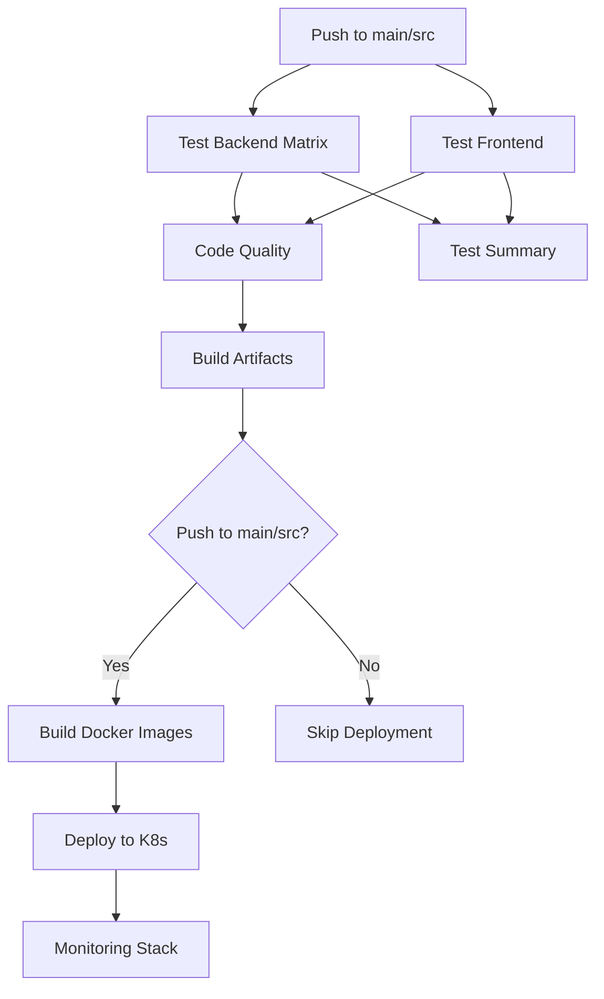

# CI/CD Pipeline Integration Guide

## 🎯 Overview

This document explains the integrated CI/CD pipeline and improvements over the previous separated workflows.

## 📊 Pipeline Comparison

### ❌ Old Approach (Separated Workflows)

```
ci.yml (Independent)                 deploy-k8s.yml (Independent)
├─ Test backend ✅                   ├─ Build Docker images (rebuilds JARs)
├─ Test frontend ✅                  ├─ Push to registry
├─ Build JARs (uploaded)             └─ Deploy to K8s
├─ Build frontend dist (uploaded)
└─ Code quality checks

❌ Issues:
- No workflow dependencies (can deploy broken code)
- Redundant builds (JARs built twice)
- Different runner environments (ubuntu vs self-hosted)
- Artifacts uploaded but never reused
- No quality gates before deployment
```

### ✅ New Approach (Integrated Pipeline)

```
Stage 1: TEST (Parallel)
├─ test-backend (5 services in matrix)
└─ test-frontend
    ↓
Stage 2: CODE QUALITY
└─ OWASP + npm audit
    ↓
Stage 3: BUILD ARTIFACTS
└─ Build JARs + frontend dist (upload artifacts)
    ↓
Stage 4: BUILD DOCKER IMAGES (only on main/src push)
└─ Download artifacts → Build images → Push to registry
    ↓
Stage 5: DEPLOY TO KUBERNETES
└─ Pull images → Deploy → Wait for rollout
    ↓
Stage 6: TEST SUMMARY
└─ Aggregate all test results

✅ Benefits:
- Enforced quality gates (tests must pass before deployment)
- Single build per artifact (reused in Docker images)
- Consistent environment (ubuntu-latest throughout)
- Artifact reuse (JARs/dist downloaded in Docker build)
- Conditional deployment (only on push to main/src)
- Clear job dependencies (needs: keyword)
```

## 🔄 Pipeline Flow



## 🎨 Key Improvements

### 1. **Job Dependencies with `needs:`**
```yaml
build-artifacts:
  needs: code-quality  # Won't run if quality checks fail
  
build-images:
  needs: build-artifacts  # Won't run if build fails
  
deploy:
  needs: build-images  # Won't run if images aren't built
```

### 2. **Artifact Reuse (No Redundant Builds)**
```yaml
# Stage 3: Build once
build-artifacts:
  - mvn clean package -DskipTests  # Already tested
  - Upload JARs as artifacts

# Stage 4: Reuse in Docker
build-images:
  - Download JARs from artifacts
  - COPY from local (no Maven rebuild in Dockerfile)
```

### 3. **Environment Consistency**
```yaml
# All jobs use ubuntu-latest (no platform differences)
runs-on: ubuntu-latest
```

### 4. **Quality Gates**
```yaml
# Tests fail → Code quality won't run
# Code quality fails → Build won't run
# Build fails → Images won't be built
# Images fail → Deployment won't happen
```

### 5. **Conditional Deployment**
```yaml
deploy:
  if: github.event_name == 'push' && (github.ref == 'refs/heads/main' || github.ref == 'refs/heads/src')
  # Only deploy on push to main/src (not on PRs)
```

### 6. **Pull Request Support**
```yaml
on:
  push:
    branches: [ main, src ]
  pull_request:
    branches: [ main ]  # Test PRs but don't deploy
```

## 🚀 Migration Steps

### Option 1: Complete Replacement (Recommended)

1. **Backup old workflows:**
   ```powershell
   New-Item -ItemType Directory -Path .github/workflows/backup -Force
   Move-Item .github/workflows/ci.yml .github/workflows/backup/
   Move-Item .github/workflows/deploy-k8s.yml .github/workflows/backup/
   ```

2. **Rename integrated workflow:**
   ```powershell
   Move-Item .github/workflows/integrated-cicd.yml .github/workflows/ci-cd-pipeline.yml
   ```

3. **Commit and push:**
   ```powershell
   git add .github/workflows/
   git commit -m "feat: integrate CI/CD pipeline with quality gates"
   git push origin main
   ```

### Option 2: Gradual Migration (Safe)

1. **Keep both workflows temporarily:**
   - Old workflows: `ci-legacy.yml`, `deploy-legacy.yml`
   - New workflow: `integrated-cicd.yml`

2. **Test new workflow:**
   - Push a feature branch
   - Verify all jobs pass
   - Check deployment works

3. **Switch over:**
   - Disable old workflows (rename to `.yml.disabled`)
   - Make new workflow primary

## 📝 Workflow Configuration

### Required Secrets
```yaml
DOCKER_USERNAME     # Docker Hub username
DOCKER_TOKEN        # Docker Hub access token (not password)
KUBE_CONFIG_DATA    # Base64-encoded kubeconfig file
```

### Generate KUBE_CONFIG_DATA:
```powershell
# Windows PowerShell
$config = Get-Content -Path $HOME\.kube\config -Raw
[Convert]::ToBase64String([System.Text.Encoding]::UTF8.GetBytes($config))
```

## 🔍 Monitoring Pipeline Progress

### GitHub Actions UI
1. Go to `Actions` tab in GitHub repo
2. Click on latest workflow run
3. Expand job stages to see progress

### Job Status Indicators
```
🟢 test-backend (user-service) → Passed
🟢 test-backend (order-service) → Passed
🔴 test-backend (payment-service) → Failed
⏸️  build-artifacts → Skipped (dependency failed)
⏹️  deploy → Not run (dependency skipped)
```

### Deployment Summary
After deployment, check `Summary` tab for:
- Pod status (all pods in namespace)
- Service endpoints
- Rollout failures (if any)
- Diagnostics artifacts (on failure)

## 🐛 Troubleshooting

### Issue: "workflow requires permission to access secrets"
**Solution:** Go to repo `Settings` → `Secrets and variables` → `Actions` → Add required secrets

### Issue: "failed to push image: denied"
**Solution:** 
1. Verify `DOCKER_USERNAME` matches Docker Hub account
2. Generate new access token at https://hub.docker.com/settings/security
3. Update `DOCKER_TOKEN` secret

### Issue: "deployment exceeded progress deadline"
**Solution:**
1. Download diagnostics artifact from failed workflow run
2. Check pod logs in artifact
3. Common causes:
   - MySQL not ready (init container should handle this)
   - Image pull errors (check Docker Hub)
   - Resource limits too low (adjust in deployment YAML)

### Issue: "kubectl: command not found"
**Solution:** The workflow uses `azure/setup-kubectl@v4` action - ensure it's running on `ubuntu-latest`

## 📊 Expected Timings

```
Stage 1: Test (Parallel)           ~5 minutes
Stage 2: Code Quality              ~3 minutes
Stage 3: Build Artifacts           ~8 minutes
Stage 4: Build Docker Images       ~10 minutes (with cache)
Stage 5: Deploy to K8s             ~5 minutes
Stage 6: Test Summary              ~1 minute
────────────────────────────────────────────
Total Pipeline Duration:           ~25-30 minutes
```

### Optimization Tips
- **First run:** ~40 minutes (no cache)
- **Subsequent runs:** ~20-25 minutes (with Docker cache)
- **Only frontend changed:** ~15 minutes (skip backend builds)
- **Only one service changed:** ~18 minutes (conditional builds)

## 🎓 Best Practices

### 1. **Commit Message Conventions**
```bash
feat: add new feature
fix: bug fix
refactor: code restructuring
docs: documentation update
test: add/update tests
ci: CI/CD changes
```

### 2. **Branch Protection Rules**
Enable in repo `Settings` → `Branches`:
- ✅ Require status checks to pass before merging
- ✅ Require branches to be up to date before merging
- ✅ Require linear history

### 3. **Pull Request Workflow**
```bash
# Create feature branch
git checkout -b feature/new-payment-gateway

# Make changes
git add .
git commit -m "feat: integrate new payment gateway"

# Push and create PR
git push origin feature/new-payment-gateway

# GitHub Actions will:
# 1. Run all tests
# 2. Check code quality
# 3. Build artifacts
# 4. NOT deploy (only on main/src)

# After PR approval and merge:
# - Full pipeline runs
# - Docker images built
# - Deployed to K8s
```

## 📚 Related Documentation

- [Monitoring Setup](./MONITORING.md)
- [How to Access Monitoring](./HOW-TO-ACCESS-MONITORING.md)
- [Kubernetes Deployment Guide](./k8s/README.md)

## 🆘 Support

If you encounter issues:
1. Check workflow logs in GitHub Actions tab
2. Download diagnostics artifacts (if available)
3. Review pod logs: `kubectl logs -l app=<service-name> -n cnpm-food --tail=100`
4. Check monitoring dashboard for service health
