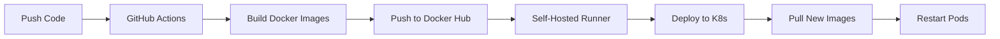

# Hướng Dẫn Deploy Ứng Dụng CNPM-Food

## Tổng Quan Kiến Trúc

Ứng dụng sử dụng kiến trúc microservices với:
- **Frontend**: Angular + Nginx (production build)
- **Backend**: Spring Boot microservices
- **Database**: MySQL
- **API Gateway**: Spring Cloud Gateway
- **Deployment**: Kubernetes + GitHub Actions CI/CD

## Quy Trình Build và Deploy

### 1. Push Code Lên GitHub

```bash
git add .
git commit -m "your commit message"
git push origin src
```

### 2. GitHub Actions Tự Động Build

Khi push code, GitHub Actions sẽ tự động:

#### Build Frontend
```dockerfile
# Multi-stage build trong frontend/Dockerfile
FROM node:18 as builder
WORKDIR /app
COPY package*.json ./
RUN npm install -g @angular/cli && npm install
COPY . .
RUN npm run build  # Build Angular app thành static files

FROM nginx:alpine
COPY --from=builder /app/dist/frontend/browser /usr/share/nginx/html
# Copy built files vào nginx
EXPOSE 80
CMD ["nginx", "-g", "daemon off;"]
```

#### Build Backend Services
Mỗi service (api-gateway, user-service, restaurant-service, order-service, payment-service) được build thành Docker image từ Spring Boot JAR files.

### 3. Push Images Lên Docker Hub

GitHub Actions tự động push images lên Docker Hub:
- `onlykohi/cnpm-frontend:latest`
- `onlykohi/cnpm-api-gateway:latest`
- `onlykohi/cnpm-user-service:latest`
- `onlykohi/cnpm-restaurant-service:latest`
- `onlykohi/cnpm-order-service:latest`
- `onlykohi/cnpm-payment-service:latest`

### 4. Self-Hosted Runner Deploy Lên Kubernetes

Self-hosted runner tự động:
1. Pull images mới từ Docker Hub
2. Apply Kubernetes configurations từ `k8s/services/`
3. Restart pods với images mới

## Cấu Hình Quan Trọng

### Frontend Configuration

#### Environment Settings
- **Production**: `frontend/src/environments/environment.prod.ts`
  ```typescript
  export const environment = {
    production: true,
    baseUrl: 'http://localhost:9000/api/v1'
  };
  ```

#### Package.json Scripts
```json
{
  "scripts": {
    "start": "ng serve --host 0.0.0.0 --port 4200 --disable-host-check --live-reload=false --hmr=false",
    "build": "ng build"
  }
}
```

### API Gateway CORS Configuration

File: `api-gateway/src/main/resources/application.yaml`

```yaml
spring:
  cloud:
    gateway:
      globalcors:
        cors-configurations:
          '[/**]':
            allowedOrigins: 
              - "http://localhost:4200"   # Dev mode
              - "http://localhost:32000"  # K8s production
            allowedMethods:
              - "GET"
              - "POST"
              - "PUT"
              - "DELETE"
              - "OPTIONS"
              - "PATCH"
            allowedHeaders:
              - "Authorization"
              - "Content-Type"
              - "Accept"
              - "Origin"
            allowCredentials: true
```

### Kubernetes Deployment

#### Frontend Deployment
File: `k8s/services/frontend-deployment.yaml`

```yaml
apiVersion: apps/v1
kind: Deployment
metadata:
  name: frontend
  namespace: cnpm-food
spec:
  replicas: 1
  template:
    spec:
      containers:
      - name: frontend
        image: onlykohi/cnpm-frontend:latest
        imagePullPolicy: Always
        ports:
        - containerPort: 80  # Nginx port
        resources:
          requests:
            memory: "512Mi"
            cpu: "250m"
          limits:
            memory: "1Gi"
            cpu: "500m"
---
apiVersion: v1
kind: Service
metadata:
  name: frontend
  namespace: cnpm-food
spec:
  type: NodePort
  ports:
  - port: 80
    targetPort: 80
    nodePort: 32000  # External access port
```

## Quy Trình Phát Triển

### Development Mode (Local)

1. **Chạy Frontend Dev Server**:
   ```bash
   cd frontend
   npm install
   npm start
   # Chạy trên http://localhost:4200
   ```

2. **Chạy Backend Services**:
   ```bash
   # Mỗi service chạy riêng với Spring Boot
   cd user-service
   ./mvnw spring-boot:run
   ```

### Production Mode (Kubernetes)

1. **Deploy tất cả services**:
   ```bash
   kubectl apply -f k8s/services/
   ```

2. **Kiểm tra pods**:
   ```bash
   kubectl get pods -n cnpm-food
   ```

3. **Xem logs**:
   ```bash
   kubectl logs -n cnpm-food -l app=frontend
   kubectl logs -n cnpm-food -l app=api-gateway
   ```

4. **Truy cập ứng dụng**:
   - Frontend: http://localhost:32000
   - API Gateway: http://localhost:9000

## Ports và Endpoints

| Service | Internal Port | NodePort | URL |
|---------|--------------|----------|-----|
| Frontend | 80 | 32000 | http://localhost:32000 |
| API Gateway | 9000 | 9000 | http://localhost:9000 |
| User Service | 8080 | - | Internal only |
| Restaurant Service | 8082 | - | Internal only |
| Order Service | 8081 | - | Internal only |
| Payment Service | 8083 | - | Internal only |
| MySQL | 3306 | - | Internal only |

## Troubleshooting

### Frontend không load được

1. **Kiểm tra pod status**:
   ```bash
   kubectl get pods -n cnpm-food -l app=frontend
   ```

2. **Xem logs**:
   ```bash
   kubectl logs -n cnpm-food -l app=frontend
   ```

3. **Restart pod**:
   ```bash
   kubectl delete pod -n cnpm-food -l app=frontend
   ```

### CORS Error

1. Kiểm tra CORS configuration trong `api-gateway/src/main/resources/application.yaml`
2. Đảm bảo origin của frontend được add vào `allowedOrigins`
3. Rebuild và redeploy API Gateway

### Database Connection Issues

1. **Kiểm tra MySQL pod**:
   ```bash
   kubectl get pods -n cnpm-food -l app=mysql
   ```

2. **Exec vào MySQL**:
   ```bash
   kubectl exec -it -n cnpm-food deployment/mysql -- mysql -u root -p
   ```

### Build Failures

1. Kiểm tra GitHub Actions logs
2. Xem Docker build logs trong workflow
3. Kiểm tra Dockerfile syntax

## Lưu Ý Quan Trọng

1. **Không build ở local** - Tất cả build process được thực hiện trong Docker image bởi GitHub Actions
2. **ImagePullPolicy: Always** - Kubernetes luôn pull image mới nhất từ Docker Hub
3. **CORS Configuration** - Phải add origin mới vào API Gateway khi thay đổi frontend port
4. **Resource Limits** - Đảm bảo Docker Desktop có đủ memory (ít nhất 8GB)
5. **Port Conflicts** - Kiểm tra port không bị conflict với services khác

## Workflow CI/CD



## Tài Nguyên Bổ Sung

- GitHub Repository: https://github.com/SupremeJelly/CNPM-Food
- GitHub Actions: https://github.com/SupremeJelly/CNPM-Food/actions
- Docker Hub: https://hub.docker.com/u/onlykohi

## Liên Hệ và Hỗ Trợ

Nếu gặp vấn đề, kiểm tra:
1. GitHub Actions logs
2. Kubernetes pod logs
3. Docker Desktop logs
4. Network connectivity

---

**Cập nhật lần cuối**: November 9, 2025
