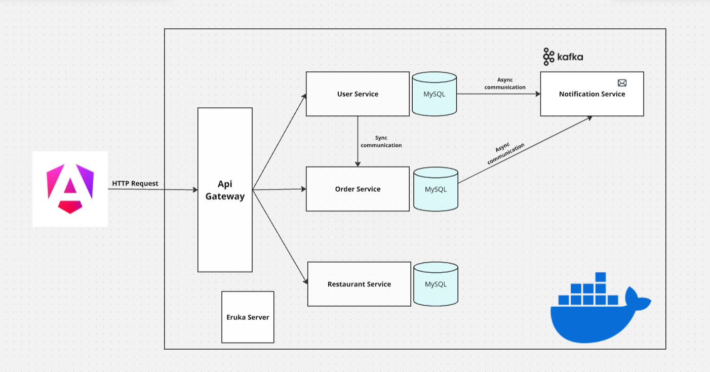
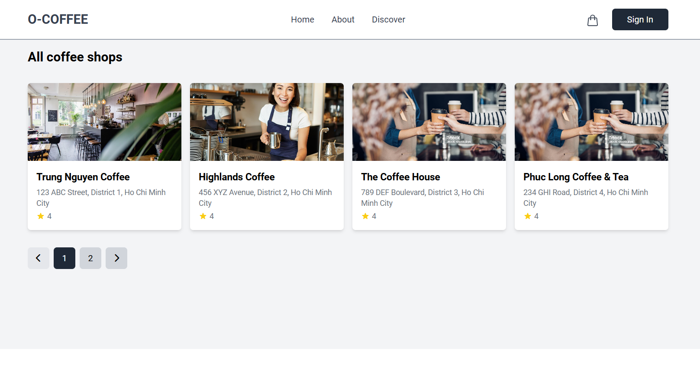
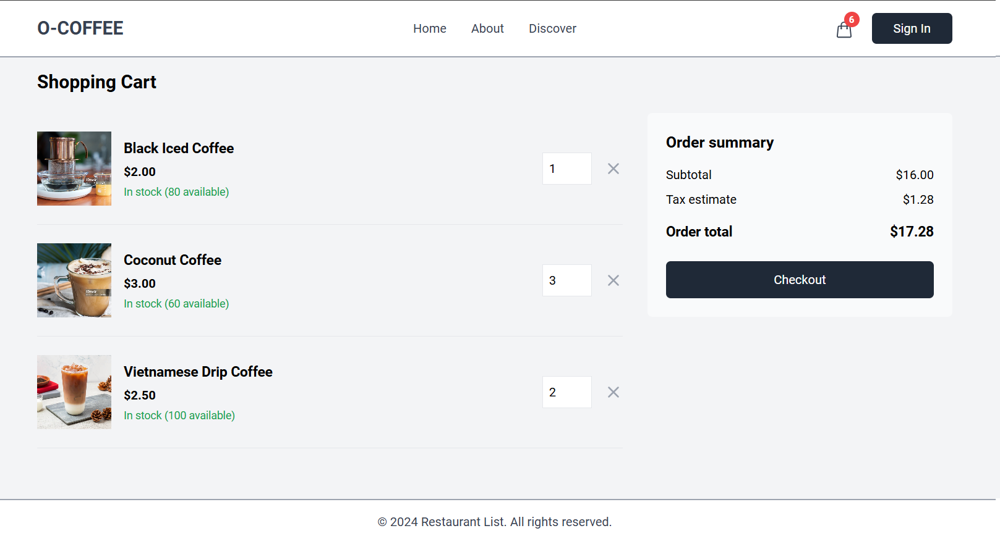
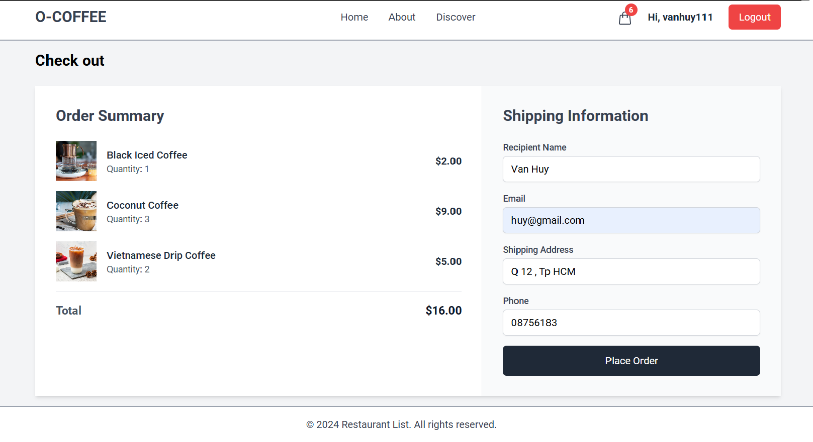
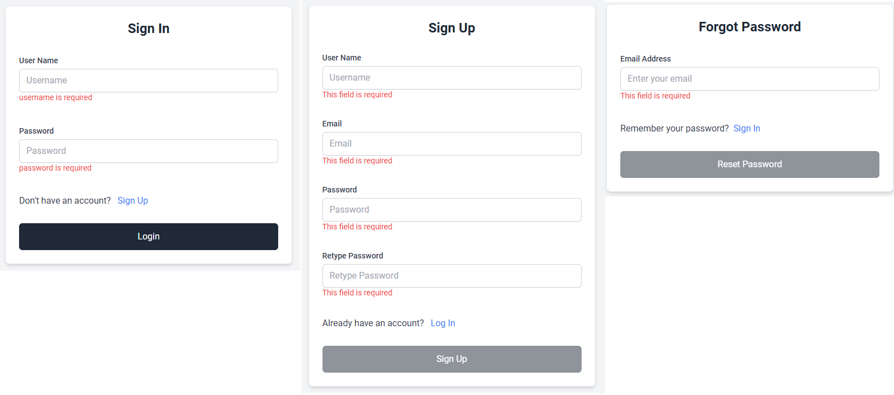
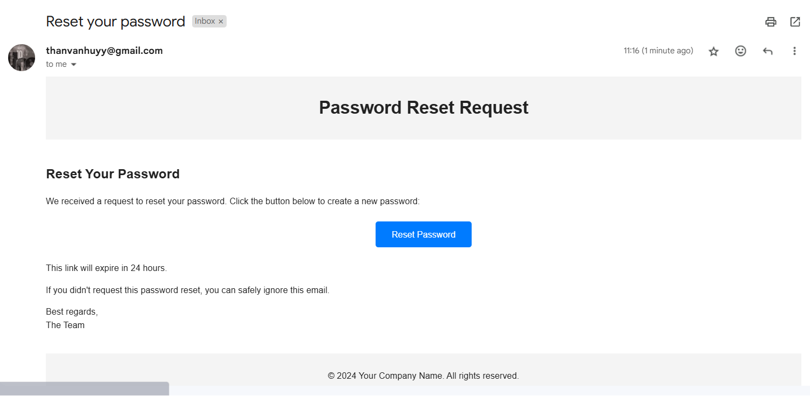

# Food Delivery Microservices Project

A scalable food delivery system designed using Spring Boot microservices architecture, enabling seamless integration and performance.

## 📁 Project Structure

```
CNPM-Food/
├── api-gateway/                 # API Gateway Service (Port: 8080)
│   ├── src/
│   │   ├── main/
│   │   │   ├── java/          # Gateway configurations
│   │   │   └── resources/     # Application properties
│   └── pom.xml
├── eureka-service/             # Service Discovery (Port: 8761)
│   ├── src/
│   │   ├── main/
│   │   │   ├── java/          # Eureka server setup
│   │   │   └── resources/     # Eureka configurations
│   └── pom.xml
├── frontend/                   # Angular Frontend
│   ├── src/
│   │   ├── app/
│   │   │   ├── component/     # Angular components
│   │   │   ├── dto/          # Data transfer objects
│   │   │   └── service/      # Angular services
│   │   ├── assets/          # Static files
│   │   └── environments/    # Environment configurations
│   ├── package.json
│   └── angular.json
├── monitoring/                # Monitoring Setup
│   ├── actuator-config.yml
│   ├── prometheus.yml
│   └── grafana/
├── notification-service/      # Notification Service (Port: 8084)
│   ├── src/
│   │   └── main/
│   └── pom.xml
├── order-service/            # Order Service (Port: 8083)
│   ├── src/
│   │   └── main/
│   └── pom.xml
├── payment-service/          # Payment Service
│   ├── src/
│   │   └── main/
│   └── pom.xml
├── restaurant-service/       # Restaurant Service (Port: 8082)
│   ├── src/
│   │   └── main/
│   └── pom.xml
├── user-service/            # User Service (Port: 8081)
│   ├── src/
│   │   └── main/
│   └── pom.xml
├── mysql-init/             # MySQL initialization scripts
│   └── init.sql
└── docker-compose.yml     # Docker composition file
```

## 🏗️ Architecture Overview

This project adopts a microservices-based architecture, ensuring modularity, fault isolation, and scalability.



## 🚀 Key Components

### Backend Services
- **API Gateway** (Port: 8080) 
  - Single entry point for requests
  - Handles routing and load balancing
  - JWT token validation

- **Eureka Service Discovery** (Port: 8761)
  - Service registration and discovery
  - Load balancing
  - Health monitoring

- **User Service** (Port: 8081)
  - User authentication
  - Profile management
  - JWT security implementation

- **Restaurant Service** (Port: 8082)
  - Restaurant data management
  - Menu management
  - Image upload handling

- **Order Service** (Port: 8083)
  - Order processing
  - Integration with users/restaurants
  - Order status tracking

- **Payment Service**
  - Payment processing
  - Multiple payment methods
  - Transaction management

- **Notification Service** (Port: 8084)
  - Email notifications
  - Kafka integration
  - Event-driven architecture

### Frontend (Angular 17)
- Modern UI with intuitive design
- JWT authentication
- Responsive layout with TailwindCSS
- Real-time updates

## 🛠️ Technologies Used

**Backend**
- Java 21
- Spring Boot 3.3.4
- Spring Cloud 2023.0.3
- Spring Security with JWT
- MySQL 8
- Apache Kafka
- OpenAPI (Swagger)

**Frontend**
- Angular 17
- TypeScript
- RxJS
- TailwindCSS
    
**DevOps & Tools**
- Docker
- Maven
- Git

## 📋 Prerequisites

Before running the project, ensure you have:
- Java 21
- Node.js 18+
- MySQL 8+
- Kafka
- Docker
- Maven

## 🚀 Getting Started

1. **Clone the Repository**
   ```bash
   git clone https://github.com/Vanhuyne/food-order-microservice.git
   cd food-order-microservice
   ```

2. **Set Up Database**
   ```bash
   # Run MySQL container or use local MySQL
   docker compose up mysql -d
   
   # Initialize database schemas
   mysql -u root -p < mysql-init/init.sql
   ```

3. **Start Backend Services**
   ```bash
   # Start services in order:
   cd eureka-service && mvn spring-boot:run
   cd ../api-gateway && mvn spring-boot:run
   cd ../user-service && mvn spring-boot:run
   cd ../restaurant-service && mvn spring-boot:run
   cd ../order-service && mvn spring-boot:run
   cd ../payment-service && mvn spring-boot:run
   cd ../notification-service && mvn spring-boot:run
   ```

4. **Start Frontend**
   ```bash
   cd frontend
   npm install
   npm start
   ```

5. **Access Services**
   - Frontend: http://localhost:4200
   - Eureka Dashboard: http://localhost:8761
   - API Gateway: http://localhost:8080
   - Swagger UI: http://localhost:8080/swagger-ui.html

## 🐳 Docker Deployment

Run the entire stack using Docker Compose:
```bash
docker compose up -d
```

## 📸 Screenshots







## 📝 Additional Notes

- For development, ensure each service's application.properties/yaml is configured correctly
- The API Gateway routes all requests to appropriate microservices
- JWT tokens are required for authenticated endpoints
- Kafka is used for asynchronous communication between services